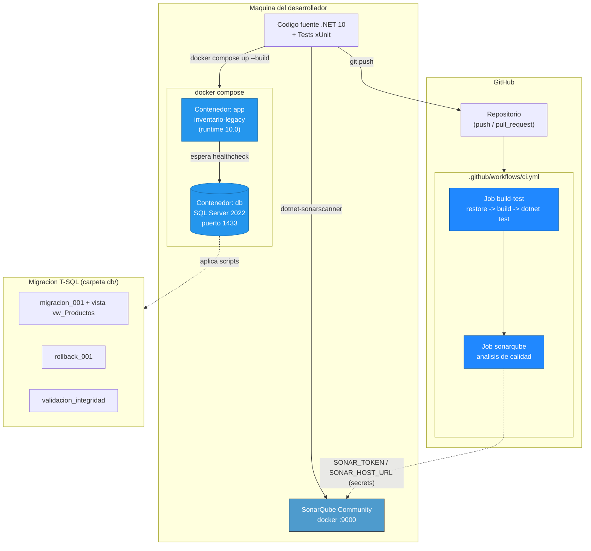

# Laboratorio 7 — Implementación y Migración (demo de referencia)

Solución **docente de referencia** del Laboratorio 7 sobre el sistema base
**SistemaInventarioLegacy**. Muestra las cuatro piezas que protegen una
reingeniería: **contenedor**, **CI/CD**, **tests de caracterización** y
**migración de esquema con rollback**.

> Adaptado a **.NET 10** (el `.csproj` del proyecto y los microservicios gRPC
> del curso usan .NET 10, no .NET 8 como traía el enunciado original).

---

## Arquitectura implementada



**Flujo:** el desarrollador construye la app + SQL Server con `docker compose`,
corre los tests localmente y (opcional) el análisis SonarQube local. Al hacer
`git push`, GitHub Actions repite build + test y, si hay secrets, envía el
análisis a SonarQube. La base de datos del contenedor recibe la migración T-SQL.

---

## Prerrequisitos

| Herramienta | Verificar con | Esperado |
|-------------|---------------|----------|
| .NET 10 SDK | `dotnet --version` | `10.0.x` |
| Docker Desktop | `docker run hello-world` | corre sin error |
| Git + cuenta GitHub | `git --version` | cualquiera reciente |
| (SonarQube) | ver sección SonarQube | contenedor en `:9000` |

---

## Parte A — Containerización

Archivos en la **raíz** del repo: [`Dockerfile`](Dockerfile) (multi-etapa
`sdk:10.0` → `runtime:10.0`), [`docker-compose.yml`](docker-compose.yml)
(`app` + `db` SQL Server 2022 con healthcheck) y [`.dockerignore`](.dockerignore).

```bash
# Construir e iniciar app + base de datos
docker compose up --build

# En otra terminal: ver estado (running / healthy)
docker compose ps

# Detener y limpiar
docker compose down
```

**Verificar solo la imagen de la app** (compila y publica en el contenedor):

```bash
docker build -t inventario-legacy:lab7 .
```

> La app es de **consola interactiva** (login por stdin). Para adjuntarle una
> terminal: `docker compose run app`. El servicio `db` sí queda corriendo como
> servidor.

**Evidencia esperada** de `docker compose ps`:

```
NAME                    IMAGE                                        STATUS
inventario-sqlserver    mcr.microsoft.com/mssql/server:2022-latest   Up (healthy)
inventario-app          inventario-legacy                            Up
```

---

## Parte B — CI/CD con GitHub Actions

Workflow: [`.github/workflows/ci.yml`](.github/workflows/ci.yml). Se dispara en
`push` y `pull_request` contra `master`/`main` (y ramas `lab7/**`).

### Cómo correrlo

1. Sube el repositorio a GitHub:
   ```bash
   git push -u origin lab7/containerizacion-cicd-tests-migracion
   ```
2. Abre la pestaña **Actions** del repo en GitHub. Verás el run
   **"CI Reingenieria - SistemaInventarioLegacy"** ejecutándose.
3. El pipeline corre dos *jobs* en cadena:
   - **`build-test`** → `dotnet restore` → `dotnet build -c Release` →
     `dotnet test`. Publica los resultados (`.trx`) como *artifact* descargable.
   - **`sonarqube`** → análisis de calidad (solo si hay secrets configurados;
     ver más abajo).

### Demostración anti-regresión (lo que se evalúa)

El propósito del pipeline es **frenar regresiones**. Para demostrarlo:

1. Rompe a propósito un *golden master*. En
   [`CaracterizacionTests.cs`](tests/SistemaInventarioLegacy.Tests/CaracterizacionTests.cs)
   el test `ProcesarVenta_ClienteVIP...` está **entregado en estado roto**
   (espera `240m` cuando el valor real es `240.125m`):
   ```csharp
   Assert.Equal(240m, r.Total); //240.125m valor esperado
   ```
2. `git push` → el pipeline se pone **ROJO** (el job `build-test` falla en
   `dotnet test`). Esto se ve en la pestaña Actions.
3. **Revierte** para volver a verde: cambia `240m` por `240.125m`, `git push`,
   y el pipeline pasa a **VERDE**.

Localmente puedes reproducir lo mismo:
```bash
dotnet test -c Release        # ahora: Failed: 1, Passed: 12  (demo en rojo)
# corrige 240m -> 240.125m
dotnet test -c Release        # Passed: 13  (verde)
```

---

## SonarQube — análisis de calidad (clave de esta semana)

Hay **dos formas** de correrlo. La reachability importa: un SonarQube en
`localhost:9000` **no** es accesible desde los runners de GitHub (nube), así que
para CI necesitas un servidor público (SonarCloud o SonarQube expuesto).

### Opción 1 — Local (recomendada para probar y ver el dashboard)

```bash
# 1) Levantar SonarQube Community en Docker
docker run -d --name sonarqube -p 9000:9000 sonarqube:community
#    Esperar ~1-2 min y entrar a http://localhost:9000  (admin / admin -> cambiar clave)

# 2) Crear un token:  My Account > Security > Generate Tokens

# 3) Instalar el scanner de .NET (una sola vez)
dotnet tool install --global dotnet-sonarscanner

# 4) Ejecutar el analisis (envolviendo el build)
dotnet sonarscanner begin \
  /k:"inventario-legacy" \
  /d:sonar.host.url="http://localhost:9000" \
  /d:sonar.token="<TU_TOKEN>"

dotnet build -c Release

dotnet sonarscanner end /d:sonar.token="<TU_TOKEN>"

# 5) Ver resultados:
#    http://localhost:9000/dashboard?id=inventario-legacy
```

**Incluir cobertura de tests en el análisis** (opcional pero recomendado):
```bash
dotnet sonarscanner begin /k:"inventario-legacy" \
  /d:sonar.host.url="http://localhost:9000" /d:sonar.token="<TU_TOKEN>" \
  /d:sonar.cs.opencover.reportsPaths="**/coverage.opencover.xml"

dotnet build -c Release
dotnet test -c Release --collect:"XPlat Code Coverage" \
  -- DataCollectionRunSettings.DataCollectors.DataCollector.Configuration.Format=opencover

dotnet sonarscanner end /d:sonar.token="<TU_TOKEN>"
```

**Cómo se prueba que funcionó:** en el dashboard de SonarQube debe aparecer el
proyecto `inventario-legacy` con su *Quality Gate* (Passed/Failed), y las
métricas de Bugs, Code Smells, Vulnerabilities, Duplications y Coverage.

### Opción 2 — En el pipeline (CI)

El job `sonarqube` de `ci.yml` ya está listo. Solo configura los *secrets*:

1. En GitHub: **Settings → Secrets and variables → Actions → New repository secret**
   - `SONAR_TOKEN` = el token de tu servidor Sonar.
   - `SONAR_HOST_URL` = URL **pública** del servidor (p. ej. `https://sonarcloud.io`
     o tu SonarQube expuesto). *No* uses `http://localhost:9000` aquí.
2. Si los secrets no existen, el job **no falla**: emite un `warning` y se omite
   (así el pipeline sigue verde en repos sin Sonar).
3. Con secrets válidos, el análisis se sube automáticamente en cada `push`.

> Nunca escribas el token dentro del `.yml`. Siempre por *secrets*.

---

## Parte C — Tests de caracterización

Proyecto xUnit: [`tests/SistemaInventarioLegacy.Tests`](tests/SistemaInventarioLegacy.Tests).
**10 tests / 13 casos** (golden master) sobre la lógica pura (`GestorVentas`,
`Utilidades`), usando *fakes* como *seam* para no tocar SMTP/disco/BD.

```bash
dotnet test -c Release
```

| # | Método probado | Entrada | Golden master |
|---|----------------|---------|---------------|
| 1 | `GestorVentas.ProcesarVenta` (VIP) | subtotal 250 | Total = **240.125** *(entregado roto: demo anti-regresión)* |
| 2 | `GestorVentas.ProcesarVenta` (Regular) | subtotal 250 | Total = 268.375 |
| 3 | `GestorVentas.ProcesarVenta` (Mayorista) | subtotal 250 | Total = 226 |
| 4 | `ProcesarVenta` invoca factura + notificación | pedido base | 1 llamada c/u |
| 5 | `FabricaDescuento` (Mayorista) | 1000 | 200 |
| 6 | `ItemVenta.Subtotal` | 3 × 1500 | 4500 |
| 7 | `Utilidades.CalcularImpuesto` | 1000 | 130 |
| 8 | `Utilidades.CalcularDescuento` (tipo 2) | 1000 | 100 |
| 9 | `Utilidades.CalcularMargen` | 150 / 225 | 50 |
| 10 | `Utilidades.ObtenerNombreEstadoPedido` | 1,3,5,99 | Pendiente/Enviado/Cancelado/Desconocido |

---

## Parte D — Migración de esquema en T-SQL

Carpeta [`db/`](db):

- [`migracion_001_normalizar_categorias.sql`](db/migracion_001_normalizar_categorias.sql)
  — migración **idempotente** + **vista de compatibilidad** `vw_Productos`.
- [`rollback_001_normalizar_categorias.sql`](db/rollback_001_normalizar_categorias.sql)
  — plan de rollback **no destructivo**.
- [`validacion_integridad.sql`](db/validacion_integridad.sql)
  — consultas de validación antes/después.

### Cómo aplicarla sobre el contenedor de SQL Server

```bash
# Con el compose arriba (servicio db en :1433). Crear el esquema base:
docker exec -i inventario-sqlserver /opt/mssql-tools18/bin/sqlcmd \
  -S localhost -U sa -P 'Reing2026$Fuerte' -C \
  -i /dev/stdin < Reinge-SistemaInventarioLegacy/setup_database.sql

# Ejecutar la migración
docker exec -i inventario-sqlserver /opt/mssql-tools18/bin/sqlcmd \
  -S localhost -U sa -P 'Reing2026$Fuerte' -C \
  -i /dev/stdin < db/migracion_001_normalizar_categorias.sql

# Validar integridad (antes y después)
docker exec -i inventario-sqlserver /opt/mssql-tools18/bin/sqlcmd \
  -S localhost -U sa -P 'Reing2026$Fuerte' -C \
  -i /dev/stdin < db/validacion_integridad.sql

# (Rollback si se requiere)
docker exec -i inventario-sqlserver /opt/mssql-tools18/bin/sqlcmd \
  -S localhost -U sa -P 'Reing2026$Fuerte' -C \
  -i /dev/stdin < db/rollback_001_normalizar_categorias.sql
```

`TotalProductos` debe ser igual antes y después; `SinVincular` y
`HuerfanosCategoria` deben ser `0`; `FilasVista` debe coincidir con el total.

---

## Qué queda para el estudiante (no incluido en este demo)

Este demo resuelve y verifica las piezas técnicas. En la **entrega evaluada**,
cada grupo debe además: capturar la evidencia de `docker compose ps`, dejar el
pipeline **verde** en su repo, ejecutar la migración registrando la validación,
llenar las celdas amarillas del informe, escribir la reflexión (Parte E) y
aplicarlo a **su** opción de proyecto.
